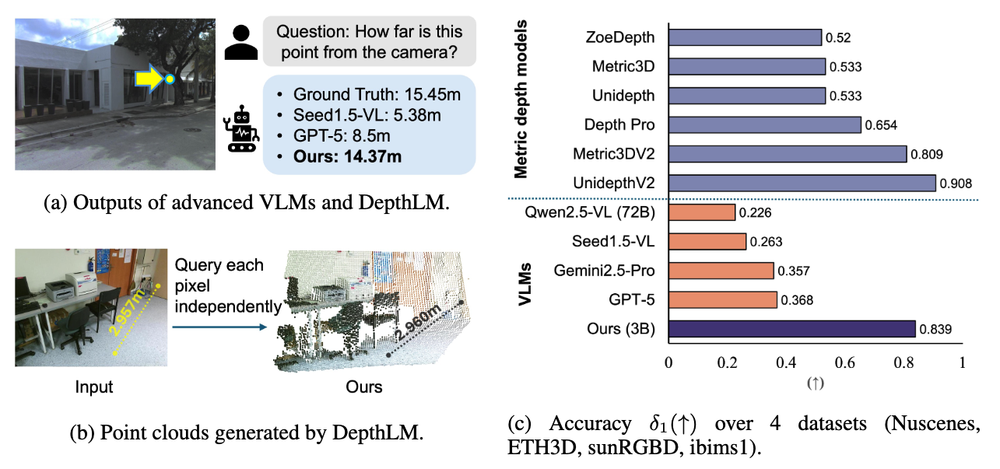
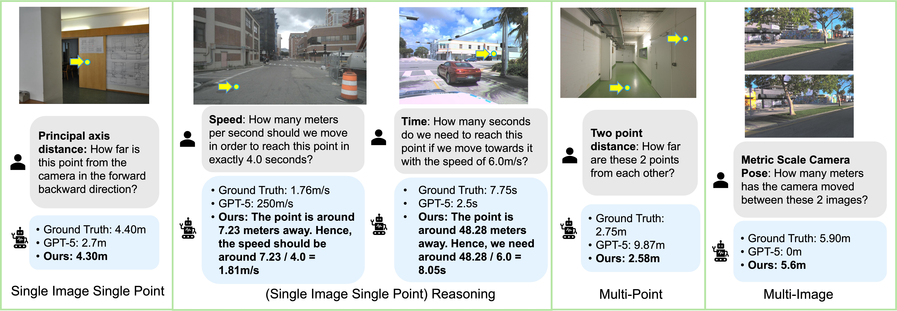
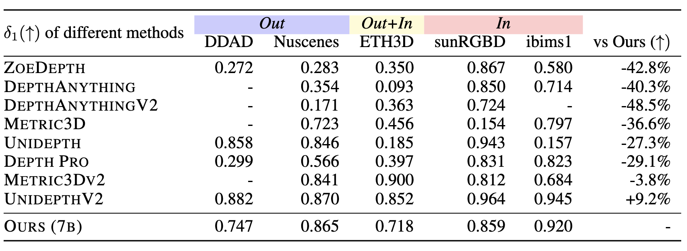
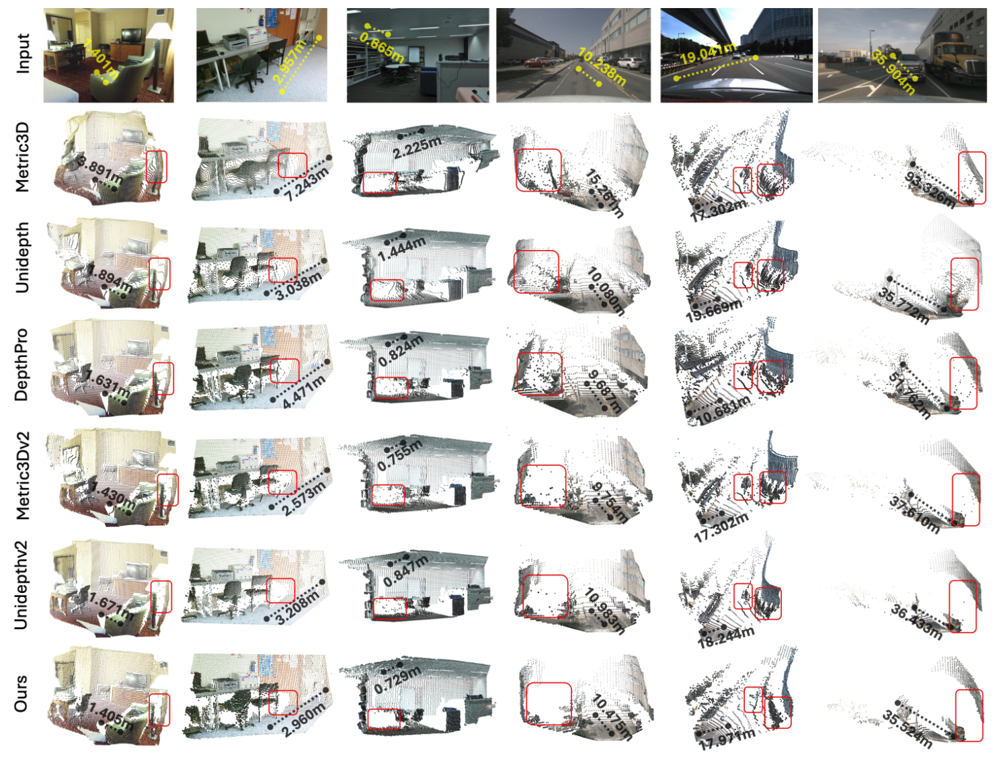

# [ICLR2026 Oral] DepthLM
Official implementation of "[DepthLM: Metric Depth from Vision Language Models](https://arxiv.org/abs/2509.25413)".


We show for the first time that **VLMs can achieve comparable accuracy with pure vision models on metric depth estimation**, with standard text-based SFT and no architecture chagne, i.e., no dense prediction head or regression/regularization loss is needed. Such simplicity allows DepthLM to train a unified VLM to handle various complex 3D understanding tasks such as speed or time estimation, and metric scale camera pose estimation, which require different architecture or hand-crafted pipelines in pure vision models.

<div align=center>

</div>

<div align=center>

</div>

## Citation

    If you find our code useful for your research, please consider citing:

    @article{cai2025depthlm,
        title={DepthLM: Metric Depth from Vision Language Models},
        author={Cai, Zhipeng and Yeh, Ching-Feng and Hu, Xu and Liu, Zhuang and Meyer, Gregory and Lei, Xinjie and Zhao, Changsheng and Li, Shang-Wen and Chandra, Vikas and Shi, Yangyang},
        journal={arXiv preprint arXiv:2509.25413},
        year={2025},
    }

## Contact
Zhipeng Cai, Meta Inc, homepage: https://zhipengcai.github.io/, email: czptc2h at gmail dot com.

## Prerequisites
1. run ```conda create -n DepthLM python=3.12```
2. run ```pip install -r requirements.txt``` (the code is tested with transformers 4.51.1 version)

| Model      |                                               Link                                                |
|:----:|:-------------------------------------------------------------------------------------------------:|
| DepthLM (Pixtral 12B)  |   [Download 🤗](https://huggingface.co/facebook/DepthLM) |
| DepthLM (3B)  |   (Coming soon!) |
| DepthLM (7B)  |   (Coming soon!) |

## Data Preparation
- For each training/eval dataset, we curate them into
    - A folder containing the images
    - A jsonl file containing the corresponding camera intrinsics and 3D labels
- We provide example data from the iBims1 dataset at examples/ibims1 for quick code run without the need of data preparation. Other images/datasets can use the same code after finishing the data preparation steps.
- Due to legal reasons, we cannot directly release the curated data. However, we provide the data curation code to enable reproduction.
- Checkout each block in [prepare_data.sh](https://github.com/facebookresearch/DepthLM_Official/blob/main/prepare_data.sh) for the detailed data preparation steps on each dataset.

## Eval
- run ```bash eval.sh <path_to_your_model>```


## Training
- Download the base model you want to train from [here](https://huggingface.co/Qwen/Qwen2.5-VL-3B-Instruct/tree/main). Our code currently supports Qwen2.5-VL and Pixtral, please see our paper for the corresponding hyper-parameters.
- run ```bash train.sh <path_to_your_model> <output_path>```

## Results

### Comparison with VLMs

<div align=center>

</div>

### Comparison with pure vision models

<div align=center>

</div>

### Point cloud visualization

<div align=center>

</div>


## License
DepthLM is FAIR CC-BY-NC licensed, as found in the LICENSE file.
